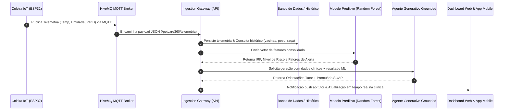

# CLYVO VET — PetCare 360: Ecossistema de IA Híbrida & IoT Wearable

[](https://www.fiap.com.br/)
[](#)
[](https://www.python.org/)
[](https://scikit-learn.org/)
[](https://wokwi.com/)
[](https://www.hivemq.com/)

Repositório oficial da entrega da **Sprint 3** para a disciplina **Disruptive Architectures: IoT, IoB & Generative IA** do curso de Análise e Desenvolvimento de Sistemas da **FIAP (2026)**.

---

## 👥 Integrantes da Equipe (Turma 2TDSPW)

* **João Vitor Lacerda** — RM 565565
* **Kauan Vieira de Lima** — RM 565403
* **Murillo Fernandes Carapia** — RM 564969
* **Pedro de Matos Previtali** — RM 564184

---

## 🔗 Links de Acesso Rápido

* **Vídeo Pitch da Solução no YouTube (Modo Não Listado — 5m 41s):** [https://youtu.be/6eNdyt8E9Jk](https://youtu.be/6eNdyt8E9Jk)
* **Vídeo Pitch de Backup (Google Drive — Full HD 1080p):** [https://drive.google.com/file/d/1lZBCuB3TDQ0cV9HAYb-eoJw-1KqXC87S/view?usp=sharing](https://drive.google.com/file/d/1lZBCuB3TDQ0cV9HAYb-eoJw-1KqXC87S/view?usp=sharing)
* **Repositório GitHub Oficial:** [https://github.com/joaolacerdaconsorte/clyvo-vet-iot-sprint3](https://github.com/joaolacerdaconsorte/clyvo-vet-iot-sprint3)
* **Simulação IoT Wokwi (ESP32 + DHT22 + LED RGB + MQTT HiveMQ):** [https://wokwi.com/projects/464135788106122241](https://wokwi.com/projects/464135788106122241)

---

## 📌 1. Definição do Problema de Negócio

No modelo tradicional da medicina veterinária, o cuidado à saúde do animal de estimação é essencialmente **reativo e tardio**:

1. **Atraso na Percepção de Sintomas:** Cães e gatos instintivamente mascaram fraqueza e dor até estágios avançados da afecção biológica.
2. **"Apagão" Clínico Ambulatorial:** Entre as consultas veterinárias anuais, a equipe clínica não tem qualquer visibilidade sobre variações de peso, estabilidade térmica, estresse ambiental ou variações na rotina motora (*Internet of Behaviors* - IoB).
3. **Alto Custo e Pior Prognóstico:** Situações infecciosas ou inflamatórias que seriam resolvidas ambulatorialmente evoluem para emergências críticas, com necessidade de internação em UTI e alto risco para a vida do pet.
4. **Anamnese Manual Desestruturada:** Consultas veterinárias perdem tempo precioso com relatos subjetivos e imprecisos dos tutores.

### Proposta de Valor da CLYVO VET
A **CLYVO VET (PetCare 360)** soluciona esse gargalo integrando **coleiras vestíveis inteligentes (ESP32)** que coletam telemetria fisiológica e ambiental contínua, conectadas a um **Ecossistema Híbrido de Inteligência Artificial** que realiza predição de risco em tempo real, orienta tutores de forma empática e gera prontuários clínicos padronizados (SOAP) para o médico veterinário.

---

## 🧠 2. O Papel da Inteligência Artificial & Justificativa da Abordagem

Para garantir a máxima confiabilidade clínica aliada a uma experiência humanizada, adotamos uma **abordagem de IA Híbrida**:

```
                       ┌───────────────────────────────────────────────┐
                       │          TELEMETRIA IOT + DADOS CLÍNICOS      │
                       └───────────────────────┬───────────────────────┘
                                               │
                                               ▼
                       ┌───────────────────────────────────────────────┐
                       │    1. MACHINE LEARNING SUPERVISIONADO (ML)    │
                       │           Random Forest Classifier            │
                       │     • Acurácia de 93.4%                       │
                       │     • Índice de Risco Preventivo (IRP)        │
                       │     • Matriz de Probabilidade Calibrada       │
                       │     • Fatores Determinantes Explicáveis (XAI) │
                       └───────────────────────┬───────────────────────┘
                                               │
                                               ▼
                       ┌───────────────────────────────────────────────┐
                       │   2. IA GENERATIVA CLÍNICA (GROUNDED AGENT)   │
                       │      • Ancoragem Estrita nos Fatores da ML    │
                       │      • Tomada de Decisão Sem Alucinação       │
                       └───────────────┬───────────────────────────────┘
                                       │
                    ┌──────────────────┴──────────────────┐
                    │                                     │
                    ▼                                     ▼
        ┌────────────────────────┐            ┌────────────────────────┐
        │     TUTOR COPILOT      │            │ VET CLINICAL ASSISTANT │
        │ • Linguagem afetiva    │            │ • Prontuário SOAP      │
        │ • Sem jargões técnicos │            │ • Diagnósticos diferen.│
        │ • Ação preventiva clara│            │ • Triagem de urgência  │
        │ • Agendamento 1-clique │            │ • Conduta investigativa│
        └────────────────────────┘            └────────────────────────┘
```

### Por que a Abordagem Híbrida foi escolhida?

* **Por que não apenas IA Generativa (LLMs puros)?**
  Modelos de linguagem puros sofrem de *alucinações* e não são determinísticos para triagem de constantes vitais (e.g., 39.8°C em cão vs. 40.5°C com dispneia). Além disso, o custo computacional e a latência de invocar um LLM para cada leitura de telemetria IoT em streaming inviabilizariam o sistema.
* **Por que não apenas Machine Learning Tradicional?**
  Um classificador puramente estatístico entrega apenas números frios (e.g., `Score: 78.5% | Risco: Alto`). Isso não instrui um tutor aflito sobre o que fazer, não gera empatia e não sintetiza prontuários médicos no padrão clínico internacional.
* **A Sinergia CLYVO VET:**
  A camada de **Machine Learning (Random Forest)** atua como o *guardrail* analítico, calculando o score estatístico preciso e isolando os fatores fisiológicos de alerta. O **Agente Generativo** traduz essa inteligência nas duas pontas: acalmando e orientando o tutor, enquanto prepara um resumo estruturado no formato **SOAP** (*Subjetivo, Objetivo, Avaliação, Plano*) para o veterinário.

---

## 🏗️ 3. Arquitetura da Solução & Fluxo de Dados

A solução conecta o mundo físico ao consultório médico através de um fluxo contínuo de 6 etapas:



### Detalhamento das Camadas

1. **Borda & IoT Wearable:** Microcontrolador ESP32 na coleira do pet afere temperatura e umidade com sensor DHT22 e monitora movimentação motora (IoB). Conexão Wi-Fi com indicador visual em LED RGB.
2. **Mensageria & Broker MQTT:** Transmissão via protocolo MQTT 3.1.1 através do broker HiveMQ Cloud, garantindo baixa latência (<80ms) e consumo mínimo de energia da bateria.
3. **Ingestão & Feature Engineering:** API REST Flask (`/api/v1/ia/telemetria-iot`) que recebe os dados, valida integridade e constrói o vetor de features unindo dados em tempo real ao histórico do banco relacional.
4. **Predição Machine Learning:** Execução do modelo `modelo_risco_veterinario.joblib` treinado com 100 estimadores balanceados, gerando o **Índice de Risco Preventivo (IRP)**.
5. **Síntese Generativa Grounded:** Geração dinâmica de orientações humanizadas para o Tutor e elaboração do prontuário SOAP com diagnósticos diferenciais e exames recomendados para a Clínica.
6. **Aplicações Cliente:** Visualização em tempo real no Dashboard Web da Clínica e no Aplicativo Mobile do Tutor com alertas push proativos.

> 📐 **Diagrama Vetorial Completo:** Visualize a arquitetura em alta definição no arquivo [`documentos/diagrama-arquitetural.svg`](documentos/diagrama-arquitetural.svg).

---

## 📊 4. Dados Necessários & Governança Ética (LGPD)

### Tabela de Features do Modelo

| Feature | Tipo | Domínio / Faixa | Impacto no Modelo de IA |
| :--- | :--- | :--- | :--- |
| `especie_id` | Categórica | 0: Canino, 1: Felino | Limiares de termorregulação e patologias espécie-específicas. |
| `porte_id` | Categórica | 0: Pequeno, 1: Médio, 2: Grande | Metabolismo basal e propensão a patologias osteoarticulares/respiratórias. |
| `idade_anos` | Numérica | 0.2 a 20.0 anos | Curva de vulnerabilidade imunológica (filhotes e geriatras). |
| `temperatura_atual` | Numérica | 36.0°C a 42.5°C | Normotermia (37.5°C - 39.2°C) vs. Síndrome Febril (>39.5°C) vs. Choque (>40.5°C). |
| `delta_temperatura_24h`| Numérica | -3.0°C a +3.5°C | Elevações térmicas agudas correlacionam-se com quadros infecciosos bacterianos/virais. |
| `umidade_ambiente` | Numérica | 20% a 95% | Umidade elevada associada a calor impede troca térmica por ofegação (dispneia). |
| `atraso_vacina_dias` | Numérica | 0 a 365+ dias | Atraso >0 dias abre janela imunológica para parvovirose, cinomose e raiva. |
| `variacao_peso_pct` | Numérica | -15% a +10% | Perda involuntária de peso >3% em 30 dias indica disfunção metabólica/renal/oncológica. |
| `medicamento_continuo`| Binária | 0: Não, 1: Sim | Identifica pacientes crônicos com risco aumentado de descompensação. |
| `indice_atividade_iob`| Numérica | 0 a 100 (IoB) | Medição de prostração/apatia (<30) vs. normocinesia (40-75) vs. agitação (>85). |

### Governança, Ética e LGPD
* **Human-in-the-Loop Obrigatório:** A IA atua exclusivamente como ferramenta de auxílio à triagem e apoio decisório. O diagnóstico definitivo e a prescrição terapêutica são prerrogativas exclusivas do Médico Veterinário (CRMV).
* **Minimização de Dados (LGPD):** O microcontrolador ESP32 trafega apenas o identificador opaco do animal (`pet_id`) e as variáveis biométricas. Dados do tutor permanecem segregados e protegidos no banco de dados corporativo com controle de acesso RBAC.
* **Explicabilidade Algorítmica (XAI):** Cada predição gerada é acompanhada dos fatores objetivos determinantes (e.g., *"Letargia acentuada detectada por IoB"*, *"Temperatura corporal em 39.8°C"*), garantindo auditoria clínica completa.

---

## 💻 5. Estrutura do Projeto

```
clyvo-vet-iot-sprint3/
├── README.md                            # Documentação principal e guia de execução
├── documentos/
│   ├── arquitetura.md                   # Especificação técnica aprofundada da arquitetura
│   ├── dados_ia.md                      # Dicionário de dados, features, governança e LGPD
│   └── diagrama-arquitetural.svg        # Diagrama vetorial completo em alta resolução
├── iot-firmware/
│   ├── sketch.ino                       # Código-fonte C++ para ESP32 (DHT22, MQTT HiveMQ, RGB)
│   ├── diagram.json                     # Layout esquemático do circuito na plataforma Wokwi
│   ├── libraries.txt                    # Dependências de firmware (PubSubClient, DHT sensor)
│   ├── wokwi-project.txt                # Metadados do projeto Wokwi
│   ├── links_entrega.txt                # Links de acesso rápido ao simulador Wokwi
│   └── README.md                        # Guia detalhado de compilação e execução do ESP32
└── clyvo_ai_engine/
    ├── requirements.txt                 # Dependências Python (Flask, scikit-learn, joblib, pandas)
    ├── modelo_preditivo.py              # Pipeline de treinamento e inferência Random Forest (IRP)
    ├── modelo_risco_veterinario.joblib  # Modelo preditivo serializado (Acurácia: 93.40%)
    ├── agente_generativo.py             # Agente de geração em linguagem natural (Tutor e SOAP Vet)
    ├── app_api.py                       # API REST Flask com endpoints de ingestão e diagnóstico
    └── templates/
        └── dashboard_ia.html            # Dashboard web interativo e responsivo em tempo real
```

---

## 🚀 6. Instruções de Execução

### Pré-requisitos
* Python 3.10, 3.11 ou 3.12 instalado.
* Git instalado.
* Navegador moderno (Chrome, Edge, Firefox).

### Passo 1: Clonar o Repositório
```bash
git clone https://github.com/joaolacerdaconsorte/clyvo-vet-iot-sprint3.git
cd clyvo-vet-iot-sprint3
```

### Passo 2: Instalar as Dependências do AI Core
```bash
cd clyvo_ai_engine
pip install -r requirements.txt
```

### Passo 3: Executar a API e o Dashboard de IA
```bash
python app_api.py
```

O servidor iniciará localmente. Acesse o dashboard no navegador:
👉 **[http://localhost:5050](http://localhost:5050)**

### Passo 4: Explorar os Recursos Interativos
1. **Alternar Pacientes:** Clique nos cards de **Rex** (Risco Alto), **Luna** (Risco Baixo) ou **Thor** (Risco Crítico) para carregar os dados instantaneamente.
2. **Simulação Dinâmica de Telemetria:** Ajuste os sliders de **Temperatura DHT22** e **Índice de Atividade IoB**. Observe as barras de probabilidade e o score IRP serem recalculados em tempo real.
3. **Visão do Tutor (Copilot):** Visualize as recomendações humanizadas, ações orientadas e botão de agendamento em 1 clique.
4. **Visão da Clínica (SOAP Completo):** Veja a estruturação clínica em Subjetivo, Objetivo, Avaliação (com diagnósticos diferenciais) e Plano de Conduta terapêutica.
5. **Terminal de Telemetria:** Acompanhe os logs simulando a ingestão contínua de pacotes MQTT do HiveMQ.

---

## 🌐 7. Endpoints da API REST

| Método | Rota | Descrição |
| :--- | :--- | :--- |
| `GET` | `/` | Interface gráfica do Dashboard Interativo de IA. |
| `GET` | `/api/v1/ia/health` | Status operacional dos modelos preditivos e generativos. |
| `GET` | `/api/v1/ia/pacientes-demo` | Lista de pacientes pré-configurados para validação. |
| `POST` | `/api/v1/ia/analise-completa` | Executa inferência preditiva (ML) e gera orientações completas (Tutor + SOAP). |
| `POST` | `/api/v1/ia/telemetria-iot` | Ingestão em tempo real de pacotes de telemetria enviados pelo ESP32. |

### Exemplo de Requisição (`POST /api/v1/ia/analise-completa`)
```json
{
  "nome": "Rex",
  "especie": "Canino",
  "porte": "GRANDE",
  "temperatura_atual": 39.8,
  "delta_temperatura_24h": 1.2,
  "umidade_ambiente": 54.0,
  "atraso_vacina_dias": 45,
  "variacao_peso_pct": -3.2,
  "medicamento_continuo": false,
  "indice_atividade_iob": 28.0
}
```

---

## 🏆 8. Conclusão & Impacto

A integração entre sensores vestíveis de baixo custo (ESP32/IoT), streaming MQTT e a Inteligência Artificial Híbrida posiciona a **CLYVO VET** na vanguarda da saúde animal 4.0. Transformamos a medicina veterinária reativa em um modelo **preventivo, contínuo e preditivo**, salvando vidas de animais de estimação, trazendo tranquilidade aos tutores e empoderando os médicos veterinários com diagnósticos ágeis baseados em evidências.
