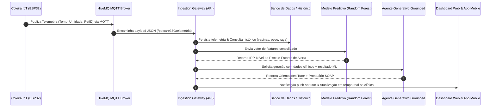

# Arquitetura da Solução de Inteligência Artificial & IoT — CLYVO VET

**Disciplina:** Disruptive Architectures: IoT, IoB & Generative IA (Sprint 3 — FIAP 2026)  
**Projeto:** CLYVO VET (PetCare 360)  
**Equipe (Turma 2TDSPW):**
- João Vitor Lacerda — RM 565565
- Kauan Vieira de Lima — RM 565403
- Murillo Fernandes Carapia — RM 564969
- Pedro de Matos Previtali — RM 564184

---

## 1. Visão Geral e Problema de Negócio

No modelo veterinário convencional, o cuidado à saúde do animal de estimação é predominantemente **reativo e tardio**. Tutores levam seus cães e gatos ao consultório apenas quando sintomas visíveis ou alterações comportamentais graves já se manifestaram clinicamente (e.g., febre avançada, apatia profunda, perda severa de peso ou dor aguda). 

As principais dores identificadas no ecossistema veterinário são:
1. **Dificuldade de Percepção do Tutor:** Pets instintivamente mascaram sinais de vulnerabilidade e desconforto biológico nos estágios iniciais de patologias.
2. **Atraso no Diagnóstico e Pior Prognóstico:** Casos que poderiam ser resolvidos ambulatorialmente tornam-se emergências de alto custo e risco de óbito.
3. **Descontinuidade do Cuidado:** Entre uma consulta anual e outra, há um "apagão" de informações sobre o estilo de vida, oscilação ponderal e comportamento do animal (*Internet of Behaviors* - IoB).
4. **Sobrecarga Clínica e Falta de Padronização:** Médicos veterinários despendem horas preenchendo relatórios anamnésicos desestruturados a partir de memórias vagas do tutor.

### A Solução Proposta
A **CLYVO VET (PetCare 360)** transforma essa dinâmica ao implementar uma **jornada contínua, preventiva e preditiva de saúde animal**. Sensores inteligentes vestíveis (*wearables* IoT baseados em ESP32) capturam continuamente telemetria biométrica e comportamental (IoB). Esses dados são integrados ao prontuário clínico e processados por um **Ecossistema Híbrido de Inteligência Artificial**, capaz de antecipar riscos de saúde, emitir alertas orientados e apoiar decisões clínicas em tempo real.

---

## 2. Abordagem de Inteligência Artificial Híbrida

Para atender com máxima segurança, precisão e empatia aos dois públicos da plataforma (o **Tutor** e o **Médico Veterinário**), optou-se por uma arquitetura de IA **híbrida e complementar**, unindo:

```
                          ┌──────────────────────────────────────────────┐
                          │         TELEMETRIA IOT + DADOS CLÍNICOS      │
                          └──────────────────────┬───────────────────────┘
                                                 │
                                                 ▼
                          ┌──────────────────────────────────────────────┐
                          │   1. CAMADA PREDITIVA (MACHINE LEARNING)     │
                          │        Random Forest Classifier (IRP)        │
                          │    Score Numérico + 4 Níveis + Explicabilidade │
                          └──────────────────────┬───────────────────────┘
                                                 │
                                                 ▼
                          ┌──────────────────────────────────────────────┐
                          │    2. CAMADA GENERATIVA (GROUNDED ASSISTANT) │
                          │     Geração de Linguagem e Raciocínio Clínico │
                          └──────────────┬────────────────────────┬──────┘
                                         │                        │
                                         ▼                        ▼
                        ┌────────────────────────┐  ┌────────────────────────┐
                        │     TUTOR COPILOT      │  │  VET CLINICAL ASSISTANT│
                        │ - Linguagem empática   │  │ - Prontuário SOAP      │
                        │ - Sem jargões técnicos │  │ - Diagnósticos diferenc.│
                        │ - Ação imediata clara  │  │ - Conduta investigativa│
                        └────────────────────────┘  └────────────────────────┘
```

### Por que não apenas IA Generativa (LLM puro)?
1. **Ausência de Determinismo e Alucinações:** Modelos puramente generativos podem oscilar na interpretação de limiares térmicos críticos (e.g., 39.8°C em cão vs. 40.5°C em gato sob estresse térmico), gerando falsos negativos perigosos.
2. **Latência e Custo Operacional:** Executar chamadas pesadas de LLM para fluxos massivos de telemetria IoT em streaming contínuo (milhares de leituras por minuto) seria inviável técnica e economicamente.
3. **Falta de Calibração Probabilística:** LLMs não fornecem probabilidades bem calibradas de classes de risco (Baixo, Moderado, Alto, Crítico) com garantia estatística.

### Por que não apenas Machine Learning Tradicional?
1. **Incapacidade de Comunicação Humanizada:** Um classificador supervisionado entrega apenas um vetor numérico (e.g., `classe: 2, score: 78.5%`). Isso não orienta um tutor aflito nem explica o que fazer em casa.
2. **Rigidez Estrutural:** Não sintetiza dados históricos heterogêneos em anotações clínicas prontas para o fluxo diário do veterinário (como a estrutura SOAP aceita mundialmente).

### A Sinergia da Abordagem Híbrida
- **Machine Learning Preditivo (Random Forest):** Avalia as *features* tabulares e de streaming (temperatura, umidade, delta 24h, atraso vacinal, oscilação de peso, índice IoB de atividade) e calcula o **Índice de Risco Preventivo (IRP)** com 93.4% de acurácia, determinando probabilidades e os fatores patológicos contribuintes.
- **Agente Generativo Fundamentado (*Grounded*):** Recebe o diagnóstico probabilístico e as variáveis do paciente como *ground truth*, atuando com duas personas dedicadas:
  - **Tutor Copilot:** Gera mensagens amigáveis, empáticas e acionáveis, incentivando a prevenção sem gerar pânico.
  - **Assistente Clínico Veterinário:** Constrói automaticamente o prontuário no formato **SOAP** (*Subjetivo, Objetivo, Avaliação, Plano de Conduta*) com sugestão de diagnósticos diferenciais fundamentados e triagem de urgência.

---

## 3. Fluxo de Dados Ponta a Ponta

O ciclo de vida dos dados na plataforma Clyvo Vet segue seis etapas sequenciais:



1. **Sensoriamento & Borda (IoT):** A coleira inteligente equipada com ESP32 e sensores biométricos/ambientais (DHT22 para temperatura e microclima, acelerômetro para atividade motora) afere as métricas do animal.
2. **Comunicação Confiável (MQTT):** Os dados são empacotados em JSON compacto e transmitidos via Wi-Fi/MQTT para o Broker HiveMQ no tópico `petcare360/telemetria`.
3. **Ingestão e Enriquecimento:** O gateway de ingestão autentica a mensagem, valida a consistência dos dados e busca no banco de dados o perfil cadastral do pet (idade, porte, histórico vacinal, medicamentos).
4. **Inferência Preditiva (ML):** O vetor multidimensional é submetido ao modelo de Random Forest, que calcula o IRP e pontua os alertas fisiológicos.
5. **Síntese Generativa:** Caso o risco fuja da normalidade ou sob demanda de consulta, o agente generativo sintetiza as orientações para o tutor e a nota SOAP para a equipe clínica.
6. **Entrega de Valor:** O tutor recebe orientações personalizadas no app; a clínica visualiza o paciente na fila de prioridade com o prontuário pré-estruturado.

---

## 4. Arquitetura Técnica de Componentes

A arquitetura do sistema é dividida em quatro camadas principais:

### Camada 1: Dispositivo IoT & Wearable (Edge)
- **Controlador:** Espressif ESP32 NodeMCU Wi-Fi.
- **Sensores:**
  - Sensor DHT22 (temperatura e umidade ambiental/superfície).
  - Indicador de status local: LED RGB (Verde = Normal, Amarelo = Alerta, Vermelho = Febre/Crítico).
- **Protocolo:** MQTT 3.1.1 sobre TCP com autenticação e QoS 1.
- **Ambiente de Simulação:** Wokwi Virtual Prototyping Platform (`https://wokwi.com/projects/464135788106122241`).

### Camada 2: Mensageria & Ingestão
- **Broker MQTT:** HiveMQ Cloud / HiveMQ Broker.
- **Tópicos:**
  - `petcare360/telemetria`: Streaming contínuo de dados de sensores.
  - `petcare360/alertas`: Comandos de retorno para acionamento na coleira.
- **Gateway de Ingestão:** Endpoint REST em Python Flask (`/api/v1/ia/telemetria-iot`) com conversão e buffer de leitura.

### Camada 3: Núcleo de Inteligência Artificial (`clyvo_ai_engine`)
- **Pipeline de Machine Learning:**
  - Biblioteca: `scikit-learn`, `numpy`, `pandas`, `joblib`.
  - Algoritmo: Random Forest Classifier (100 estimadores, balanceamento de classes).
  - Acurácia de Validação: **93.40%**.
  - Features de Entrada: Espécie, porte, idade, temperatura atual, delta 24h, umidade, atraso vacinal, variação de peso, uso de medicação contínua, índice IoB de atividade motora.
- **Agente Generativo Clínico:**
  - Base de Conhecimento: Diretrizes veterinárias (faixas normotérmicas canina e felina: 37.5°C a 39.2°C; protocolos de vacinação V8/V10, antirrábica e quádrupla felina).
  - Gerador de SOAP: Estruturação automática em Subjetivo, Objetivo, Avaliação e Plano.
  - Gerador Tutor: Mensagens em linguagem acessível, claras e empáticas.

### Camada 4: Apresentação & Integração com Aplicações
- **Dashboard Web Interativo (HTML5/CSS3/JavaScript Vanilla):**
  - Monitoramento de telemetria em tempo real com sliders interativos de temperatura e atividade IoB.
  - Alternância instantânea entre pacientes de demonstração (Rex, Luna, Thor).
  - Visualização de probabilidades de risco em barras de progresso animadas.
  - Abas exclusivas para visão do Tutor (Copilot) e visão da Clínica (SOAP Completo).
  - Terminal de telemetria simulando conexão viva com HiveMQ.
- **APIs RESTful:**
  - `GET /api/v1/ia/health`: Diagnóstico de integridade e versões dos modelos.
  - `GET /api/v1/ia/pacientes-demo`: Catálogo de casos clínicos de teste.
  - `POST /api/v1/ia/analise-completa`: Execução do pipeline preditivo + generativo.
  - `POST /api/v1/ia/telemetria-iot`: Ingestão direta de eventos de telemetria do ESP32.

---

## 5. Benefícios da Solução

### Benefícios para o Tutor
- **Tranquilidade Ativa:** Monitoramento silencioso da saúde do animal 24 horas por dia, 7 dias por semana.
- **Comunicação Acessível:** Alertas sem jargões incompreensíveis, instruindo exatamente quando observar o pet e quando levá-lo ao veterinário.
- **Economia Financeira:** Diagnóstico precoce reduz custos catastróficos com internações de emergência e procedimentos invasivos.
- **Engajamento Preventivo:** Lembretes inteligentes para regularização de vacinas, pesagem e desverminação.

### Benefícios para a Clínica Veterinária (CLYVO VET)
- **Anamnese Agilizada:** O médico veterinário recebe o prontuário SOAP pré-preenchido com histórico, telemetria recente e hipóteses diagnósticas preliminares.
- **Triagem Inteligente:** Pacientes críticos (e.g., hipertermia severa em animais braquicefálicos) são priorizados automaticamente na fila de espera.
- **Aumento da Fidelização:** O tutor mantém vínculo contínuo com a clínica através do ecossistema de cuidado digital.
- **Medicina Baseada em Evidências:** Decisões clínicas respaldadas por telemetria contínua e dados biométricos reais, não apenas no relato subjetivo do tutor.
